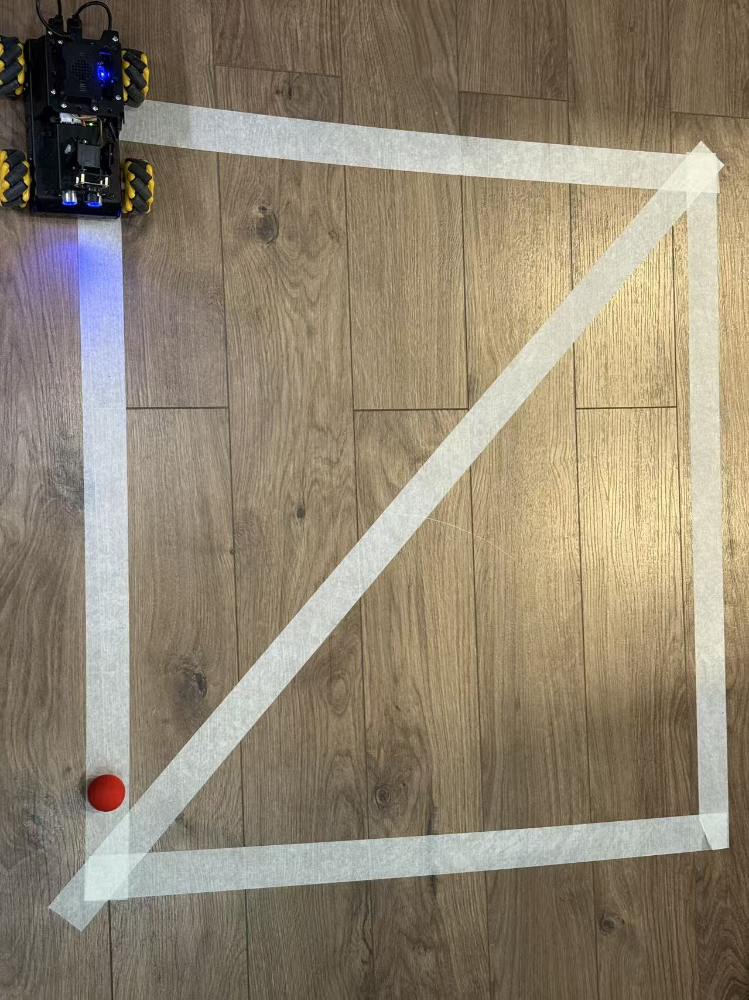
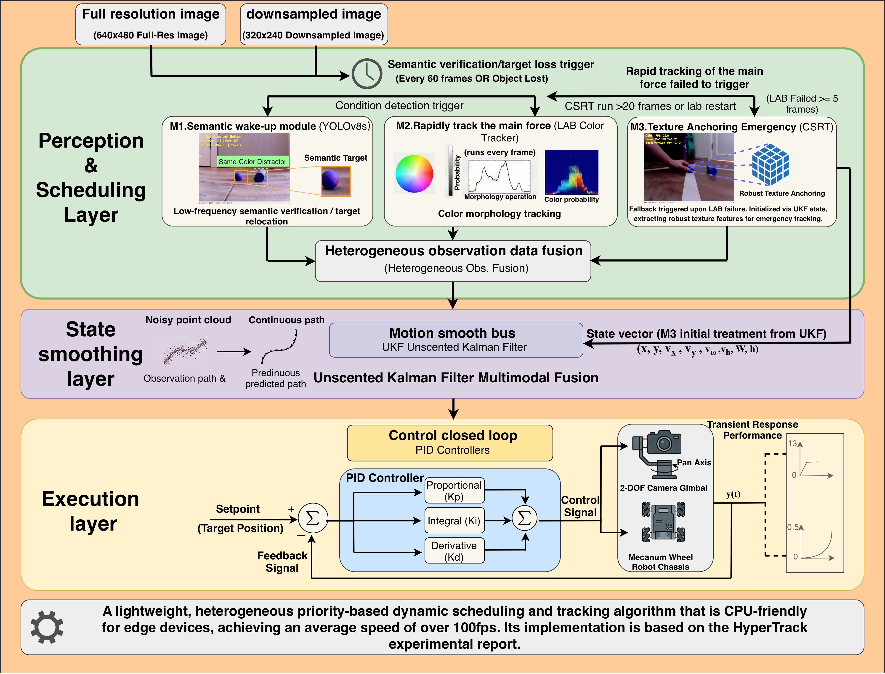
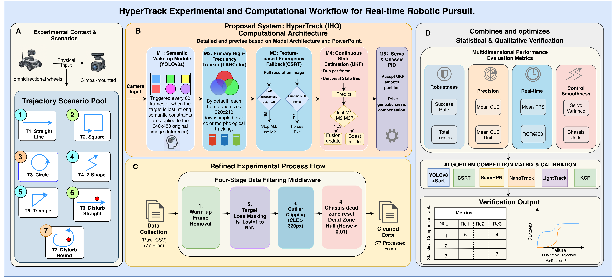
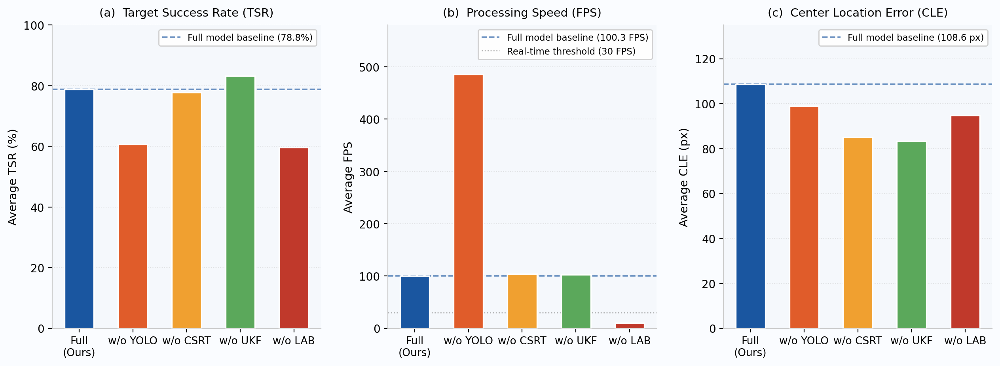
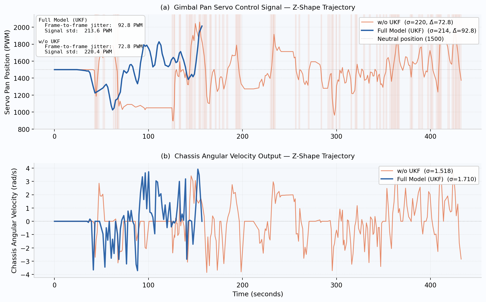
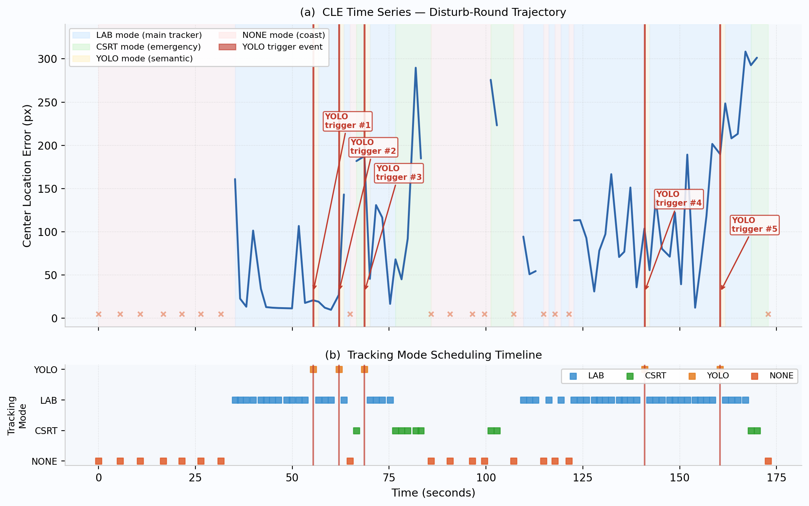

# HyperTrack

**HyperTrack: A Heterogeneous Priority-Scheduled Multimodal Fusion Visual Tracking System for GPU-Free Consumer Edge Robotic Platforms**

HyperTrack is a real-time visual object tracking system deployed on a ROS 2 mobile robot platform (mecanum-wheel chassis + 2-DOF gimbal). It achieves **>100 FPS** and robust tracking under same-color distractor interference on a **GPU-free ARM edge device** (Raspberry Pi 5), by cascading four heterogeneous tracking modules in a dynamic priority-dispatch architecture with UKF state smoothing.

---

## Key Contributions

-**Heterogeneous Priority-Scheduled Dynamic Dispatch**: Four tracking modules (LAB color morphology → CSRT texture-anchoring → YOLOv8s semantic calibration → UKF coast) are arranged into an ordered cascade degradation pipeline, guaranteeing real-time performance (≥100 FPS) while maximizing robustness.

-**LAB Color Morphology Tracker (M2 — main force)**: Runs every frame in ≤3 ms at 320×240 resolution, providing the high-throughput backbone of the system. Uses nearest-neighbor LAB color matching with spatial reliability to distinguish target from background.

-**CSRT Texture-Anchoring Emergency Tracker (M3)**: Activated for up to 20 frames upon consecutive LAB failures (threshold = 5 frames). Applies discriminative correlation filtering with HOG + color-histogram features and a spatial reliability map to re-anchor the target.

-**YOLOv8s Semantic Wake-up Calibration (M1)**: Deployed in ONNX format on CPU at low frequency (every 60 frames, ~1.7% amortized overhead), providing global semantic correction that prevents long-term drift under same-color distractor interference.

-**UKF Multimodal Fusion & State Smoothing**: An 8-dimensional Unscented Kalman Filter fuses heterogeneous observations from M1/M2/M3. Adaptive noise covariance selection (`R_M1`, `R_M2`, `R_M3`) dynamically adjusts trust per module; coast mode sustains gimbal control during brief occlusions.

-**Gimbal–Chassis Co-tracking Control**: Dual-axis PID servo control with chassis angular velocity compensation when gimbal deflection exceeds threshold `θ_chassis`, enabling full-body cooperative target following.

-**Comprehensive Evaluation Framework**: Seven trajectory scenarios (Straight, Square, Circle, Z-Shape, Triangle, Disturb-Straight, Disturb-Round), four-stage data-cleaning middleware, and metrics covering TSR, CLE, RMSE, FPS, MLCF, J_servo, J_chassis, CPS, and module dispatch distribution ρ.

---

## Experiment Workflow

The experimental pipeline covers three stages as illustrated in the paper:

**A — Trajectory Scenario Pool**

Seven standardized trajectories are defined to probe different tracking challenges:

| ID | Trajectory | Evaluation Focus |
|----|------------|-----------------|
| T1 | Straight Line | Steady-state baseline |
| T2 | Square | Abrupt directional changes |
| T3 | Circle | Smooth trajectory following |
| T4 | Z-Shape | Rapid direction alternation |
| T5 | Triangle | Combined straight & angular |
| T6 | Disturb-Straight | Same-color distractor interference |
| T7 | Disturb-Round | Hardest: interference + continuous motion |


*Overhead view of the experimental area showing the paths for the seven trajectory scenarios (Straight, Square, Circle, Z-Shape, Triangle, Disturb-Straight, and Disturb-Round).*

**B — System Computational Architecture**

Each incoming frame is processed in priority order: M2 (LAB) is evaluated first; on consecutive failure M3 (CSRT) is activated; M1 (YOLO) fires asynchronously every 60 frames for semantic recalibration. All observations are fused by the UKF, whose smoothed output drives PID servo + chassis control.

**C — Four-Stage Data Cleaning Middleware**

Raw CSV logs undergo: (1) field validation, (2) timestamp continuity checking, (3) servo command range clamping to `[S_min, S_max]`, and (4) kinematic velocity constraint filtering (`V_max`). This produces 231 consistently cleaned CSV files (77 per trial × 3 independent trials) for statistical analysis.

**D — Multidimensional Performance Evaluation**

Key metrics: Target Success Rate (TSR), Center Location Error (CLE), RMSE, average FPS (harmonic mean), Maximum Length of Continuous Tracking Frames (MLCF), servo smoothness variance J_servo, chassis MSE J_chassis, and Comprehensive Performance Score (CPS).

---

## Results and Comparisons

### System Architecture



*Three-layer architecture: Perception & Scheduling Layer (M1/M2/M3), State Smoothing Layer (UKF), and Execution & Control Layer (PID + chassis compensation).*

### Experimental Workflow



*Full experimental workflow: trajectory scenario pool (A), system computational architecture (B), four-stage data filtering middleware (C), and multidimensional evaluation framework (D).*

### TSR Comparison — Radar Chart



*TSR radar chart of all seven algorithms across seven trajectories. HyperTrack (dark-blue solid line) encloses the largest area, with the strongest advantage in distractor scenarios (Disturb-S/R) and complex motion scenarios (Triangle, Square).*

### Ablation Study



*Three-panel ablation bar chart: (a) average TSR, (b) average FPS, (c) average CLE. Removing LAB collapses FPS to 10.4; removing YOLO drops TSR by −18.1 pp, demonstrating the irreplaceability of each module.*

### Servo Control Smoothing (UKF Effect)



*Servo control signal time series comparing full HyperTrack vs. w/o UKF on Z-Shape (T4). The UKF version concentrates chassis angular velocity variance in the low-frequency band, producing significantly smoother control.*

### Quantitative Summary

**TSR (%) — Mean ± Std Dev over 3 Trials:**

| Trajectory | **Ours** | YOLO+SORT | CSRT | KCF | NanoTrack | LightTrack | SiamRPN |
|------------|----------|-----------|------|-----|-----------|------------|---------|
| Straight   | **55.2** ± 1.2 | 8.0 | 17.6 | 9.2 | 17.5 | 14.4 | 28.3 |
| Square     | **85.4** ± 1.2 | 7.5 | 32.6 | 5.6 | 21.4 | 26.8 | 27.4 |
| Circle     | **76.1** ± 1.2 | 4.8 | 73.2 | 2.6 | 29.9 | 50.0 | 24.2 |
| Z-Shape    | **76.9** ± 1.2 | 26.1 | 32.4 | 4.7 | 17.9 | 31.8 | 43.1 |
| Triangle   | **90.7** ± 1.2 | 5.3 | 40.6 | 3.0 | 7.7 | 26.6 | N/A |
| Disturb-S  | **87.9** ± 1.2 | 33.3 | 52.8 | 5.6 | 19.6 | 53.0 | 21.2 |
| Disturb-R  | **79.5** ± 1.2 | 13.0 | **93.8** | N/A | 27.9 | 34.3 | 22.4 |
| **Average**| **78.8** | 14.0 | 49.0 | 5.1 | 20.3 | 33.8 | 27.8 |

**Average FPS — HyperTrack: 100.3 ± 3.5 | YOLO+SORT: 1.9 ± 0.1**
**Ablation Study (averaged across 7 trajectories):**
| Variant | TSR (%) | CLE (px) | FPS |
|---------|---------|---------|-----|
| Full Model (Ours) | **78.8** ± 1.2 | 108.6 ± 2.1 | **100.3** ± 3.5 |
| w/o YOLO | 60.7 ± 1.2 | 98.9 ± 2.1 | 486.0 ± 3.5 |
| w/o CSRT | 77.8 ± 1.2 | 85.1 ± 2.1 | 103.7 ± 3.5 |
| w/o UKF  | 83.2 ± 1.2 | 83.3 ± 2.1 | 102.3 ± 3.5 |
| w/o LAB  | 59.6 ± 1.2 | 94.7 ± 2.1 | 10.4 ± 0.8 |
---

## Project Structure

```
hypertrack/
├── tracking.py                        # Main ROS 2 node: LAB+CSRT+YOLO+UKF fusion tracker
├── HyperTrack.pdf                     # Full paper
├── images/                            # images
│   ├── *.png
└── results/
    ├── ablation_experiment/
    │   ├── off-csrt/                  # w/o CSRT variant logs (7 trajectories × CSV)
    │   ├── off-lab/                   # w/o LAB variant logs
    │   ├── off-ukf/                   # w/o UKF (full model) variant logs
    │   └── off-yolo/                  # w/o YOLO variant logs
    └── comparative_experiment/
        ├── csrt/                      # CSRT baseline logs
        ├── KCF/                       # KCF baseline logs
        ├── LightTrack/                # LightTrack baseline logs
        ├── NanoTrack/                 # NanoTrack baseline logs
        ├── SiamRPN/                   # SiamRPN baseline logs
        └── yolov8s+sort/              # YOLO+SORT baseline logs
```

---

## Requirements

**Hardware:**

| Component | Specification |
|-----------|-----------------------------------------------------|
| Processor | Raspberry Pi 5 (ARM Cortex-A76, quad-core, 2.4 GHz) |
| Memory    | 16 GB LPDDR4X RAM |
| GPU       | None — CPU-only inference |
| Camera    | USB, 640×480 @ 30 FPS |
| Gimbal    | 2-axis PWM servo (pan/tilt) |
| Chassis   | Mecanum-wheel omnidirectional platform (TurboPi) |

**Software / Python Dependencies:**

```
# ROS 2 (Humble or Jazzy)
rclpy
cv_bridge
sensor_msgs
geometry_msgs
std_srvs
# Vision & Tracking
opencv-python        # cv2 (CSRT, LAB color space)
ultralytics          # YOLOv8s ONNX inference
# State Estimation
filterpy             # UnscentedKalmanFilter, MerweScaledSigmaPoints
# Utilities
numpy
```

**ROS 2 Custom Interfaces (provided by the TurboPi robot SDK):**

-`interfaces/srv/SetPoint`, `SetFloat64`

-`large_models_msgs/srv/SetString`

-`ros_robot_controller_msgs/msg/SetPWMServoState`, `RGBState`, `RGBStates`

-`sdk.common`, `sdk.pid`

**Pre-trained Model:**

Place `yolov8s.onnx` at `/home/ubuntu/yolov8s.onnx` on the robot (trained for colored spherical ball detection).

---

## Quick Start

This project uses the Docker environment from [wltjr/docker-ros2-jazzy-gz-rviz2-turbopi](https://github.com/wltjr/docker-ros2-jazzy-gz-rviz2-turbopi), which contains instructions to install.

---

## License

This project is licensed under the [MIT License](LICENSE).  
